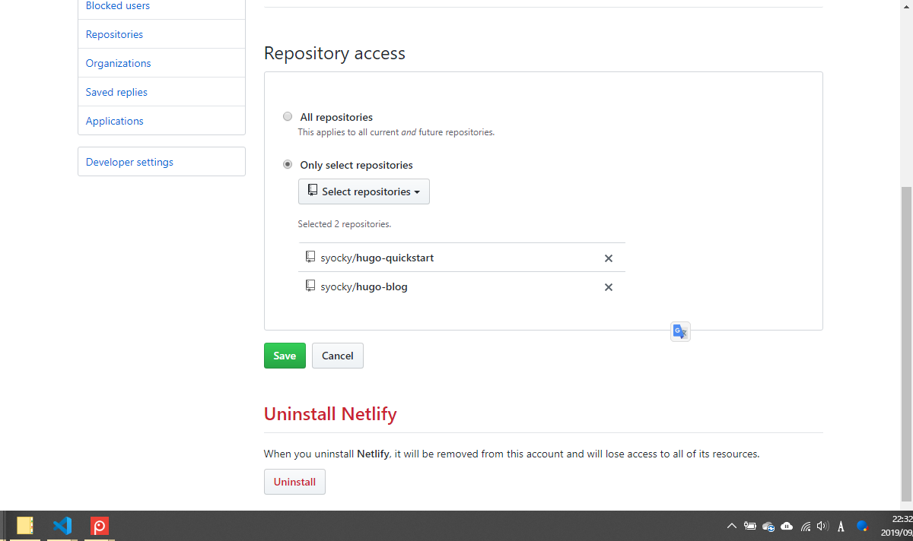
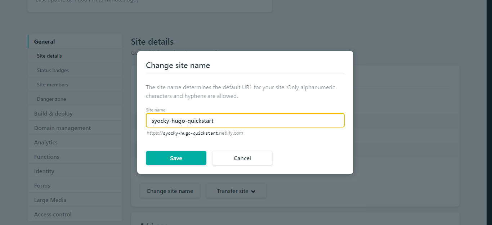

== Hugoとは

image::/images/eye-catch/hugo.png[]

https://gohugo.io/[公式トップページ^] によると、
____
[%hardbreaks]
The world’s fastest framework for building websites
Hugo is one of the most popular open-source static site generators. With its amazing speed and flexibility, Hugo makes building websites fun again.
____

[%hardbreaks]
つまり、
Hugoは、OSSな静的サイトジェネレーターで、サイト生成がめちゃ速いよ！
だそうです。

=== HUGOの特徴

==== 静的サイト

[%hardbreaks]
Hugoは静的サイトをビルドするためのフレームワークです。
静的サイトとは、HTML、CSS、JavaScriptで構成されており、サーバーサイドの処理はありません。
さらに、基本的にはHTML、CSS、JavaScriptをゴリゴリ書く必要もありません。
Hugoにはテンプレート機能があり、 https://themes.gohugo.io/[公開されているテーマ^] がたくさんあるので、好みのもの選んで使えます。
また、選んだテーマを自分でカスタマイズすることも可能です。その場合は、Hugoの仕組みや、HTML / CSS / JavaScriptの知識が多少必要となります。（少しカスタマイズする程度であれば、そんなに難しくはないと思います。）

[%hardbreaks]
記事はMarkdown / AsciiDocなどの軽量マークアップ言語で書けます。
Hugoでビルドすれば、それを元にHTMLを生成してくれるので、記事を書くときはテキストで構造的な文章で書けるのが魅力だと思います。

==== 高速＆マルチプラットフォーム

[%hardbreaks]
Hugoは、Go言語で実装されています。
そのため、マルチプラットフォームでHugoを使えて、サイト生成が高速でできます。

=== リファレンス

* https://qiita.com/peaceiris/items/ef38cc2a4b5565d0dd7c[Hugo で静的なサイト・ブログを構築しよう^]
* https://qiita.com/zak74702675/items/b84cd883c01d72720c35[HUGOで静的サイトを作成してみた^]
* https://atuweb.net/201806_hugo-change-to/[ブログを Hugo にしたらメリットしかなかった件^]
* https://www.meganii.com/blog/2017/01/08/static-site-generator-hugo/[静的サイトジェネレータ「Hugo」でシンプルブログサイトを構築する^]

== Netlifyとは

image::/images/eye-catch/netlify.png[]

静的サイトをホスティングしてくれるサービスです。

[%hardbreaks]
Hugoでは静的サイト(HTMLなど)が生成されるだけなので、それを外部に公開する必要があります。
昔であればWEBサーバを自前で構築して・・など、知識も労力も必要な大変な作業でしたが、Netlifyは、そこらへんをいい感じで請け負ってくれるサービスです。
簡単な手順で、しかも無料で！！

=== Netlifyの特徴

==== 無料で利用可能

有料プランもありますが、基本的な主要機能は無料で利用できますし、
月間の転送量上限は100GBまでの制限なので、個人用途であれば十分かと思います。

https://www.netlify.com/pricing/#features[Plan details^]

==== CD（継続的デプロイ）

[%hardbreaks]
Netlifyのメイン機能がこれです。
GitHub / GitLabなどのGitリポジトリと連携し、リポジトリへのPushを検知したら、自動でビルド＆デプロイをしてくれます。
CIツール（Jenkins / CircleCI）は必要ありません。
つまり、事前設定さえしておけば、あとは記事をリポジトリにPushするだけで、自動で公開されちゃうわけです。

===== Gitリポジトリ

[%hardbreaks]
リポジトリはpublicでもprivateでもNetlifyは利用可能です。 
また、ブランチ毎にデプロイ可能なので、ステージング環境として開発ブランチにPushしてプレビューし、確認ができたら、masterブランチにMergeして本番環境へ適用といった運用も可能になります。

===== ビルド

ビルドはHugoだけではありません。
Node、Python、Rubyなどのビルドが可能になっています。

https://www.netlify.com/docs/continuous-deployment/[Continuous Deployment^]

==== SSL / HTTPS化

特別な設定をすることなく、HTTPS化、HTTP/2通信が可能となります。

https://www.netlify.com/docs/ssl/[HTTPS on Custom Domains^]

==== CDNで高速配信

CSS・画像などをNetlify側でキャッシュしてくれて、
CDNサーバは日本にも設定されているそうなので、表示速度向上が期待できるそうです。

==== Webhooks対応

デプロイしたらSlack通知とかできそうです。

https://www.netlify.com/docs/webhooks/[Webhooks^]

==== 独自ドメイン利用可能

独自ドメインを持たれている方は、無料でそのドメインを適用できます。

https://www.netlify.com/docs/custom-domains/[Custom Domains^]

=== リファレンス

* https://qiita.com/TakahiRoyte/items/b7c4d1581df1a17a93fb[高機能ホスティングサービスNetlifyについて調べて使ってみた^]
* https://tech.qookie.jp/posts/info-netlify-static-web-deploy/[NetlifyはGitHubなどからデプロイできる静的Webホスティングサービス^]
* https://rightcode.co.jp/blog/information-technology/netlify-github-up[NetlifyとGithubを連携させ、サイトのアップロード作業を自動化する方法^]
* https://yoshidashingo.hatenablog.com/entry/2016/08/22/193821[Netlifyは最強の静的ウェブサイトホスティングサービスかもしれない^]

== QuickStart

HugoとNetlifyを使って、サンプル用のサイトを構築してみます。

=== Hugo

Hugo公式に手順があるので、基本はそれに従えばOKです。

https://gohugo.io/getting-started/quick-start/[Quick Start^]

私の手順を載せておきます。

==== Hugoのインストール

ローカル環境にHugoをインストールします。 + 
私の場合は、WSLにLinuxbrewを導入しているので、それでインストールしました。

```fish
$ brew install hugo
```

インストールが完了したら、Hugoのバージョンを確認

```fish
$ hugo version
Hugo Static Site Generator v0.55.6/extended linux/amd64 BuildDate: unknown
```

==== Hugoで新規サイトを作成

`hugo-quickstart` という名前のサイトを作成します。 + 
`hugo` コマンドを使って作成します。

```fish
$ hugo new site hugo-quickstart
```

作成すると、下記のようなディレクトリ構成になっています。

```fish
$ tree hugo-quickstart
hugo-quickstart
├── archetypes
│   └── default.md
├── config.toml
├── content
├── data
├── layouts
├── static
└── themes

6 directories, 2 files
```

[%hardbreaks]
次に、テーマを追加します。
https://themes.gohugo.io/[ここのテーマ^]から好きなものを選んでもOKですし、 https://hugo-theme-ranking.oika.me/[ランキングされた人気のテーマ^]から選んでもOKです。
公式のチュートリアルは、 https://themes.gohugo.io/gohugo-theme-ananke/[Ananke theme^] で説明していますが、私は色々テーマを使ってみた結果、 https://github.com/dim0627/hugo_theme_robust[robust^] というテーマを使っています。このブログもrobustテーマをベースに少しカスタマイズしています。
なぜかrobustテーマは上記リンクのテーマリストには入ってないんですよね。
ただ作者が日本の方ということもあり、robustテーマを扱った日本語の記事がよく見つかります。

```fish
$ cd hugo-quickstart
$ git init
$ git submodule add https://github.com/dim0627/hugo_theme_robust.git themes/robust
```

次に、config.tomlを修正します。

```toml
baseURL = "https://syocky-hugo-quickstart.netlify.com/"
title = "Hugo QuickStart"
theme = "robust"
```

`baseURL` は、独自ドメインを使わなければ、`xxx.netlify.com` にしておいてください。また、URLの最後には必ず「/」を入れるのを忘れないでください。
`title` は、サイトのタイトルなので好きなタイトルを指定してください。

次に、記事を追加します。
次のように、記事を追加するコマンドがあります。

```fish
$ hugo new posts/my-first-post.md
```

`content/posts/my-first-post.md` に下記のようなファイルが作成されているはずです。

```toml
---
title: "My First Post"
date: 2019-09-10T21:58:04+09:00
draft: true
---
```

少し修正してテスト記事を編集します。

```toml
---
title: "My First Post"
date: 2019-09-10T21:58:04+09:00
---

これは、テスト記事です。
```

作成した記事を、ローカル環境で確認します。

下記コマンドでHugo Serverを起動します。

```fish
$ hugo server
```

起動できたら、 `http://localhost:1313/` にアクセスすれば確認できます。


確認して問題なければ、リモートリポジトリにPUSHします。 + 
※リモートリポジトリは事前に作成しておいてください

```fish
$ git add -A
$ git commit -m "1st commit"
$ git remote add origin git@github.com:syocky/hugo-quickstart.git
$ git push -u origin master
```

参考までに今回使ったリポジトリです。 + 
https://github.com/syocky/hugo-quickstart[^]

=== Netlifyでホスティング

Hugo公式ドキュメントにNetlifyでのホスティング手順がありますので、それに従えばOKです。

https://gohugo.io/hosting-and-deployment/hosting-on-netlify/[Host on Netlify^]

私の手順を載せておきます。

※事前にNetlifyアカウント登録は完了させておいてください

==== Netlifyの設定＆デプロイ手順

https://app.netlify.com/[Netlify^]にログインして、

image::netlify_new_site.png[]

`New site from Git` をクリック


ここでは、`GitHub` を選択


該当のリポジトリが出てこない場合は、
`Configure the Netlify app on GitHub` をクリック



`Only select repositories` で該当のリポジトリを選択して `Save`


次に `hugo` のビルドコマンドなどを指定してますが、公式に従うと、hugoプロジェクト（今回だと `hugo-quickstart` ）直下に `netlify.toml` を作成すればOKです。 + 
`netlify.toml` は公式そのままコピーでOKです。

https://gohugo.io/hosting-and-deployment/hosting-on-netlify/#configure-hugo-version-in-netlify[Configure Hugo Version in Netlify^]

`netlify.toml` を作成したらPushします。

`hugo-quickstart` をクリックして、


`Deploy site` をクリックすればビルドが始まります。


しばらくして、緑色になっていればビルド成功です。

次に、サイトのURLを変更するため、`Site settings` をクリック


`Change site name` をクリック



config.tomlのURLに合わせます。

今回作成したサイトはこちらになります。

https://syocky-hugo-quickstart.netlify.com/[https://syocky-hugo-quickstart.netlify.com/^]

== まとめ

[%hardbreaks]
いかがでしたでしょうか？
個人用途のブログであれば、Hugo + Netlifyで簡単に構築できるイメージが掴めたのではないでしょうか。
次回は、このブログでも使っているrobustテーマを色々カスタマイズしているので、そのあたりを紹介していこうと思います。
