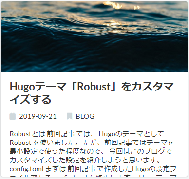
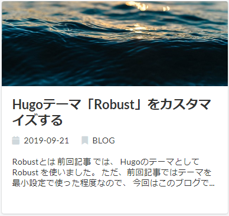
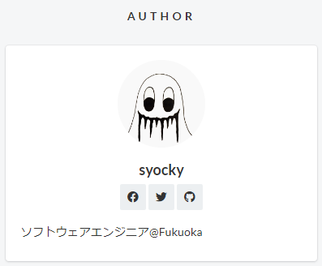
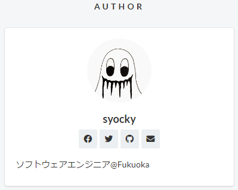

:icons: font

== Robustとは

link:/blog/2019/08/03/hugo_netlify_quickstart/[前回記事^] では、
Hugoのテーマとして https://github.com/dim0627/hugo_theme_robust[Robust^] を使いました。 +
ただ、前回記事ではテーマを最小設定で使った程度なので、
今回はこのブログでカスタマイズした設定を紹介しようと思います。

== config.toml

まずは link:/blog/2019/08/03/hugo_netlify_quickstart/[前回記事^] で作成したHugoの設定ファイルである `config.toml` を修正します。 +
Hugoテーマを提供しているREADMEなどに例が記載されていることが多いので、それをベースに作成すればOKです。 +
Robustテーマの設定例が、 https://github.com/dim0627/hugo_theme_robust#configtoml-example[こちら^] で、私のブログの設定例が https://github.com/syocky/hugo-blog/blob/master/config.toml[こちら^] になります。 +
`config.toml` にはHugoが定義している設定もあるので、 https://gohugo.io/getting-started/configuration/#all-configuration-settings[こちらの公式ドキュメント^] も合わせて参照すると分かりやすいです。

いくつかの項目を補足して説明します。

=== 記事要約の日本語対応

`hasCJKLanguage` を `true` に設定することで、日本語の記事要約が正しく動作するようになります。 +
これを設定しないと、記事要約が長く表示されてしまいます。

*「hasCJKLanguage」未設定の場合：*

*「hasCJKLanguage」設定した場合：*

=== コメント機能

ブログにコメント機能を追加したい場合は、 https://disqus.com/[Disqus^] というサービスを利用すれば簡単に導入できます。 +
https://www.ted027.com/post/disqus/[HugoブログにDisqusでコメント欄をつけた^] を参考にすれば、Disqusでshortnameが設定されるので、それを `config.toml` の `disqusShortname` に設定すればコメント機能が利用できます。

=== Googleアナリティクス

導入したい方は、払い出されたトラッキングIDを `config.toml` の `googleAnalytics` に設定すればOKです。

== フロントマター

https://gohugo.io/content-management/front-matter/[フロントマター^] とは、記事の先頭に書いている、（TOML形式の場合） `\+++` で囲まれた部分のことで、記事のパラメータを定義できます。

私のフロントマターだと下記のようにしてます。


+++
date = "2019-09-21"
lastmod = "2019-09-21"
slug = "customize-hugo-robust"
title = "Hugoテーマ「Robust」をカスタマイズする"
thumbnail = "images/eye-catch/robust.jpg"
description = ""
tags = ["Hugo", "Robust"]
archives = ["2019/09"]
+++


毎回これを書くのは大変なので、 `archetypes/default.md` に下記のようにテンプレートを用意しておくと、 `hugo new` コマンドで記事を作成した場合に雛形が出来ているので便利です。


+++
date = "{{ dateFormat "2006-01-02" .Date }}"
lastmod = "{{ dateFormat "2006-01-02" .Date }}"
slug = ""
title = ""
thumbnail = ""
description = ""
tags = []
archives = ["{{ dateFormat "2006/01" .Date }}"]
+++


各変数の説明は、 https://gohugo.io/content-management/front-matter/#front-matter-variables[こちら^] になります。

いくつか補足します。

=== サムネイル

記事のサムネイルは、フロントマターの `thumbnail` で指定できます。 +
指定しないと、デフォルトのサムネイルが設定されます。画像ファイルは、 `static/images/default.jpg` に配置してください。 +
デフォルトのサムネイルがない場合、テーマで用意されているデフォルトサムネイルが設定されます。

=== パーマリンク

https://gohugo.io/content-management/urls/[パーマリンク^] とは、ページ個別のURLのことです。 +
パーマリンクの構成をどうするかは、 `config.toml` で設定できます。


[permalinks]
  blog = "/blog/:year/:month/:day/:slug/"


`:slug` は、フロントマターに設定されている `slug` の値が設定されます。
`slug` を設定しないと、 `title` が使われてしまうので、URLに日本語が入り分かりづらくなってしまいます。
そのため、 `slug` で記事内容が分かる簡潔な英語を使った方がいいそうです。

NOTE: 変数名（この場合は `blog` ）は `/content` 直下のフォルダ名に合わせる必要があります

== ページカスタマイズ

テーマのページを変えたい場合、 `themes` ディレクトリ配下のHTMLファイルなどを直接編集しません。 +
https://gohugo.io/templates/lookup-order/[Hugo's Lookup Order^] にあるように、Hugoはページの読み込み順序が決まっています。 +
例えば、 `themes/hugo_theme_robust/layouts/partials/author.html` を変更したい場合、変更したファイルを、 `layouts/partials/author.html` に配置すれば変更したファイルが先に読み込まれます。

=== Authorページのカスタマイズ

デフォルトだとAuthorページには、 `facebook`、 `twitter`、 `github` のリンクがあります。
これに、メールのリンクを追加するカスタマイズをしてみます。

*Before：*

*After：*

まずは、 `themes` 配下にあるAuthorページを所定のディレクトリにコピーします。

[source,shell]
----
$ mkdir layouts/partials
$ cp themes/hugo_theme_robust/layouts/partials/author.html layouts/partials/author.html
----

コピーした `author.html` を編集します。


{{ with .Site.Params.author }}
<section class="sidebar">
  <header>AUTHOR</header>
  

    

      {{ with .thumbnail }}
      

      {{ end }}
      
{{ .name }}

      <ul class="author-facts">
        {{ with .facebook }}
        <li><a href="{{ . }}" rel="nofollow" target="_blank"><i class="fab fa-facebook" aria-hidden="true"></i></a></li>
        {{ end }}
        {{ with .twitter }}
        <li><a href="{{ . }}" rel="nofollow" target="_blank"><i class="fab fa-twitter" aria-hidden="true"></i></a></li>
        {{ end }}
        {{ with .github }}
        <li><a href="{{ . }}" rel="nofollow" target="_blank"><i class="fab fa-github" aria-hidden="true"></i></a></li>
        {{ end }}
        {{ with .mail }}
        <li><a href="{{ . }}" rel="nofollow" target="_blank"><i class="fas fa-envelope" aria-hidden="true"></i></a></li>
        {{ end }}
      </ul>
      
{{ .description | safeHTML }}

    

  

</section>
{{ end }}


L20-22が他と同じように追加した箇所です。
アイコンは、 https://fontawesome.com/icons?d=gallery[Font Awesomeが提供しているアイコン^] のclassを指定すればOKです。

あとは、 下記のように `config.toml` の `[params.author]` 定義内に `mail` のリンクを追加すればOKです。


[params.author]
  thumbnail = "images/logo.jpg"
  name = "syocky"
  description = "
Software Engineer@Fukuoka
"
  facebook = "https://www.facebook.com/syocky"
  twitter = "https://twitter.com/syocky"
  github = "https://github.com/syocky"
  mail = "https://docs.google.com/forms/d/e/1FAIpQLScFcxHgR4OGrRD21ognPF9CHcQdecmvfJyMdkptrR2IiXkvCQ/viewform?usp=sf_link"


ちなみに、私のメールの場合は、Googleフォームで問い合わせできるようにしています。 +
ググればやり方はたくさん出てくるので、ここでは割愛します。

=== 月別アーカイブの作成

WordPressなどのブログサービスには、年月に応じたアーカイブページが自動で作成される機能があります。
ただ、Hugoにはアーカイブ機能みたいなのはありませんが、 Hugoの `Taxonomy` という機能を使えば、比較的簡単に作成することができます。 +
https://gohugo.io/content-management/taxonomies/[Taxonomy^] とは、コンテンツをグルーピングしてくれる機能で、デフォルトではタグやカテゴリが使えるようになっています。

まず、 `config.toml` にアーカイブの定義を追加します。


[taxonomies]
  tag = "tags"
  archive = "archives"


次はサイドバーに月別アーカイブを追加するので、サイドバーページをカスタマイズします。

[source,shell]
----
$ cp themes/hugo_theme_robust/layouts/partials/sidebar.html layouts/partials/sidebar.html
----

`layouts/partials/sidebar.html` を修正します。


<aside class="l-sidebar">

  

    {{ partial "author.html" . }}
    {{ partial "latests.html" . }}
    {{ partial "categories.html" . }}
    {{ partial "tags.html" . }}
    {{ partial "archives.html" . }}
  

</aside>


次に、 `layouts/partials/archives.html` を新規作成します。


{{ with .Site.Taxonomies.archives }}
{{ partial "taxonomy.html" (dict "context" $.Site "key" "archives" "value" . "baseurl" $.Site.BaseURL) }}
{{ end }}


最後に、記事のフロントマターに `archives = ["2019/09"]` のように追加すればOKです。

=== Faviconの設定

Faviconを作成したら、 `static/favicon.ico` と `static/images/logo.jpg` に配置します。 +
さらに、 `layouts/partials/meta.html` に下記を追加したらOKです。

NOTE: `meta.html` がない場合は、 `themes/hugo_theme_robust/layouts/partials/meta.html` からコピーしてください。


<link rel="shortcut icon" type="image/x-icon" href="{{ .Site.BaseURL }}favicon.ico">


=== はてなブログカード

ブログカードは、リンク先のサムネイル、タイトル、概要などをカード形式で表示されるものです。



こういうやつ。 +
普通のリンクより見やすくて、かっちょいい感じですね。

ただ、Hugo標準にある機能ではないのですが、
はてなが提供している「ブログカード拡張機能」を利用すれば、簡単にできます。

はてなの記事だけでなく、任意のサイトにも対応しています。 +
ありがたい！

はてなでは、以下のように書くとブログカードを作成してくれるようです。

____
++
https://hatenablog-parts.com/embed?url=[任意のURL]
++
____

これを、 `iframe` で使えば、簡単にブログカードを差し込めます。

Hugoでは、ショートコードを作って、簡単に使えるようにします。

下記のようにショートコードを作成します。


<iframe class="hatenablogcard" style="width:100%;height:155px;" src="https://hatenablog-parts.com/embed?url={{ .Get "url" }}" width="300" height="150" frameborder="0" scrolling="no"></iframe>


Hugo記事内では、下記のように書けば、ブログカードが表示されます。





==== リファレンス

* https://yuzuafro.github.io/yuzuafrolog/posts/20180430_hugo3/#%E3%81%AF%E3%81%A6%E3%81%AA%E3%83%96%E3%83%AD%E3%82%B0%E3%82%AB%E3%83%BC%E3%83%89%E7%9A%84%E3%81%AA%E6%A9%9F%E8%83%BD%E3%82%92%E8%BF%BD%E5%8A%A0%E3%81%99%E3%82%8B[Hugoでブログを作る 3 · ゆずあふろのブログ^]

* https://nelog.jp/hatenablogcard[はてなブログカードのような美しい外部リンクをクリック一発で作成する方法^]

== まとめ

Hugoテーマ「Robust」について、私がカスタマイズした内容をまとめてみました。 +
ほとんど先駆者たちの記事をつまみ食いした設定になりますが・・ +
今後もカスタマイズした内容は、この記事内か、別記事で紹介していこうと思っています。

== リファレンス

* https://masaqu.id/posts/2019-06-11_robust-customize/[Hugoのテーマ、Robustを採用・カスタマイズ^]
* https://blog.zzzmisa.com/customize_hugo_theme3/[HUGO のテーマ Robust のカスタマイズver3^]
* https://browniealice.github.io/wiki/technote/hugo/setting_for_robust/[ROBUST設定^]
* https://backport.net/blog/2017/09/08/hugo_monthly_archives/[Hugoで月別アーカイブを作る^]
* http://staff.feedtailor.jp/2016/08/10/hugo_16/[静的サイトジェネレータHugoを使ったサイト構築（アーカイブ編）^]

