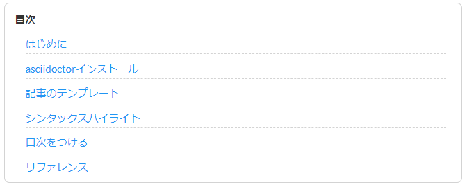

:toc:
:toclevels: 1
:toc-title:
:icons: font

== はじめに

Hugoで記事を書くときに、ほとんどの方はMarkDown形式で書いていると思います。
ただ、HugoではデフォルトでサポートしているフォーマットはMarkDown以外にもあります。
https://gohugo.io/content-management/formats/[Supported Content Formats^] にもあるように、AsciiDocもサポートされています。

私はMarkDownよりAsciiDocを好むため、このブログもAsciiDoc形式で記事を書いています。
ただ、色々ハマったところがあるので、記事としてまとめておこうと思います。

== asciidoctorインストール

AsciiDocで記事を書くためには、 `asciidoc` か `asciidoctor` をインストールする必要があります。
今回は、 `asciidoctor` をインストールします。
なお、事前にRubyはインストール済の前提とします。

=== Bundlerのインストール

インストールされていない方は、 `gem` コマンドでインストールしてください。

[source,shell]
----
$ gem install bundler
----

インストールが完了したらバージョン表示されるかを確認してください。

[source,shell]
----
$ bundler -v
Bundler version 1.17.2
----

=== Bundlerでasciidoctorをインストール

Gemfileを作成するため、hugoプロジェクト直下でコマンドを実行します。

[source,shell]
----
$ bundle init
----

Gemfleが作成されるので、次のように修正します。


# frozen_string_literal: true

source "https://rubygems.org"

git_source(:github) {|repo_name| "https://github.com/#{repo_name}" }

gem "asciidoctor"



コマンドで `asciidoctor` をインストールします。

[source,shell]
----
$ bundle install --path vendor/bundle
----

インストールが完了したらバージョン表示されるかを確認します。

[source,shell]
----
$ bundle exec asciidoctor -v
Asciidoctor 2.0.10 [https://asciidoctor.org]
----

=== 補足１

`/.bundle`, `/vendor/bundle` にファイルが作成されてますが、これらはGit上で管理する必要がないため、 `.gitignore` ファイルに記載しておいた方がいいです。
`Gemfile`, `Gemfile.lock` ファイルはGitで管理する必要があるためコミットしてください。

=== 補足２

Bundlerではなく、直接gemでインストールしちゃダメなの？と思われるかもしれません。
私も最初はgemでインストールしてました。
ただ、ローカル環境だと動作しますが、私の場合はNetlifyでホスティングしているため、BundlerでないとNetlify側でビルドエラーとなってしまいます。

なお、ローカル環境でHugoサーバを起動する場合、PATHにasciidoctorがあれば、 `hugo server` で起動できますが、bundler経由で起動する場合は、 `bundle exec hugo server` で起動する必要があります。

== 記事のテンプレート

`archetypes/default.adoc` に下記のようにテンプレートを用意しておくと、 `hugo new` コマンドで記事を作成した場合に雛形が出来ているので便利です。


---
date: "{{ dateFormat "2006-01-02" .Date }}"
lastmod: "{{ dateFormat "2006-01-02" .Date }}"
slug: ""
title: ""
thumbnail: ""
description: ""
tags: []
archives: ["{{ dateFormat "2006/01" .Date }}"]
---


== シンタックスハイライト

=== Hugoシンタックスハイライトの導入

https://gohugo.io/content-management/syntax-highlighting/[Syntax Highlighting^] にあるように、Hugo単体でシンタックスハイライトが可能になっています。

`config.toml` に下記を追加します。


pygmentsUseClasses = true
pygmentsCodeFences = true


コマンドでシンタックスハイライト用のCSSを生成します。

[source,shell]
----
$ hugo gen chromastyles --style=dracula > static/css/syntax.css
----

`--style` オプションの指定は、お好みで https://xyproto.github.io/splash/docs/all.html[こちらから^] 探してください。

CSSが生成できたら、headタグ内でそれを読み込むようにします。
私の場合は `Robust` テーマを使っているので、 `layouts/partials/meta.html` に下記を追加しました。

NOTE: `layouts/partials/meta.html` にファイルがなければ、 `themes/hugo_theme_robust/layouts/partials/meta.html` からコピーしてください


<link rel="stylesheet" href="{{ .Site.BaseURL }}css/syntax.css">


あとは記事内で `highlight` ショートコードを記載すると、

[source,java]
----

public static void main( String args[] ) {
    System.out.println("Foobar!");
}

----

コードがハイライトされます。


public static void main( String args[] ) {
    System.out.println("Foobar!");
}


オプションを併用すると細かな設定も可能になります。

[source,java]
----

public static void main( String args[] ) {
    System.out.println("Foobar!");
    System.out.println("Hogehoge!");
}

----


public static void main( String args[] ) {
    System.out.println("Foobar!");
    System.out.println("Hogehoge!");
}


蛇足ですが、Hugoのシンタックスハイライトを使う場合、 `` のショートコードを使います。
上記のようにショートコード自体を記事に入れたい場合、そのまま書いてしまうと、当然ハイライトされショートコード自体は見えなくなります。 +
Hugoのショートコードをエスケープすれば、そのままコードとして出力されます。
エスケープの仕方は何通りかあるようですが、 https://code.luasoftware.com/tutorials/hugo/how-to-escape-shortcode-in-hugo/[How To Escape Shortcode In Hugo Template^] の記事のようにコメントアウトすることでエスケープ可能となっています。

=== AsciiDocのシンタックスハイライト

最初、AsciiDocで書いているんだから、Hugoのシンタックスハイライトのコードではなく、AsciiDocのシンタックスハイライト構文を使いたいと思いました。

```
[source,java]
----
public static void main( String args[] ) {
    System.out.println("Foobar!");
}
----
```

こんな感じで書いたらハイライトされて欲しいと思いました。 +
色々調べると、 https://rgielen.net/posts/2019/creating-a-blog-with-hugo-and-asciidoctor/[Creating a Blog with Hugo and AsciiDoctor^] の記事に辿り着き、同じようにやってみたら、確かにハイライトされました。 +
ただ、なぜか画面レイアウトが少し変になる事象に遭遇し、CSSが苦手な私は諦めました。。 +
今のところは、Hugoのシンタックスハイライトで不便を感じてないので使ってますが、AsciiDocシンタックスハイライトが使えるよう改善したら、また記事にしようと思っています。

== 目次をつける

（2020/02/01追記）

`Robust` テーマで記事に目次をつけたい場合は、 フロントマターの `toc` パラメータを `true` にすればOKです。


+++
toc = true
+++


ただし、これはMarkdownで記事を書く場合です。

AsciiDocで記事を書く場合、上記では目次は出ませんでした。

ただ、AsciiDoc自体に目次機能があるので、私はそれを有効にして、スタイル調整しています。

AsciiDocで目次を出す場合は、フロントマターの下に、 `:toc:` を追加すればOKです。 +
また、目次をカスタマイズする属性もあります。

例えば、下記のような感じ


:toc:               // 目次を表示
:toclevels: 2       // 階層数を指定可能
:toc-title: 目次    // 目次タイトル 
:sectnums:          // 番号を振る


=== サンプル

私の場合は、今のところ、このような目次をつけています。



具体的には、AsciiDoc形式記事、CSSを追加する必要があります。

==== AsciiDocの記事

フロントマターの下に下記を追加します。 +
階層数は1で、目次タイトルはなし（CSSで設定）


:toc:
:toclevels: 1
:toc-title:



==== CSS

`Robust` テーマの場合、CSSをカスタマイズする場合は、
`/layouts/partials/custom.css` にファイルを配置してカスタマイズします。


#toc > ul {
  font-size: smaller;
  border-radius: 0.5em;
  border: solid 1px lightgray;
  padding: 0.5em 1em;
  line-height: 2;
}
#toc > ul:before {
  content: "目次";
  font-weight: bolder;
}
#toc ul {
  list-style-type: none;
}
#toc li {
  padding: 0.5em 0.5em 0 1em;
}
#toc li > ul {
  padding-left: 1em;
  width: 100%;
}
#toc a {
  font-weight: normal;
  display: block;
  border-bottom: dashed 1px lightgray;
}


== リファレンス

* https://takumon.github.io/asciidoc-syntax-quick-reference-japanese-translation/[Asciidoctor 文法クイックリファレンス(日本語訳)^] 
* https://asciidoctor.org/docs/user-manual/[Asciidoctor User Manual^]
* http://diary.wshito.com/comp/cms/hugo-asciidoc/[Hugo で AsciiDoc 原稿を書く際の留意点^]
* https://maku77.github.io/hugo/shortcode/highlight.html[ソースコードをハイライト表示する (highlight)^]
* https://maku77.github.io/hugo/template/table-of-contents.html[各ページに目次を表示する (.TableOfContents) | まくまくHugo/Goノート^]
* http://ytyaru.hatenablog.com/entry/2018/02/07/000000[AsciiDocで目次を自動作成する(ToC) - やってみる^]
